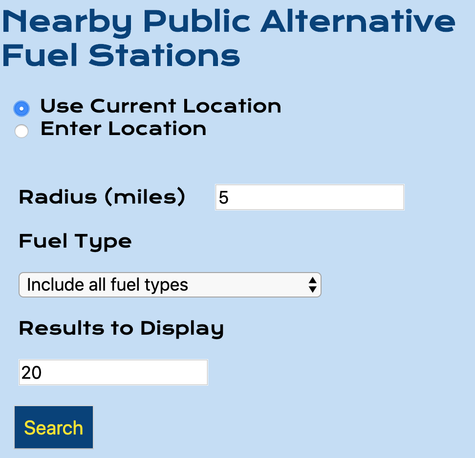
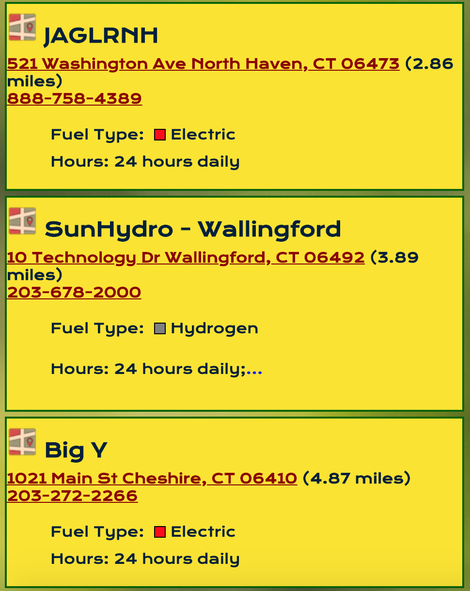

# Alternative Fuel Station Search

Search for nearby public alternative fuel stations

https://dmac1108.github.io/alternative-fuel-station-search/

# Summary

This application will enable the user to find nearby public alternative fuel stations(e.g. eletric, hydrogen, lpg, etc.). The user can choose to have the application use their current location or enter a location to search. The application will provide the specified number of results to the user with important station information including a link to navigate to the station, call the station, station type, and hours. 

  

# Technology

This application was developed using html, css javascript, and jquery. 

